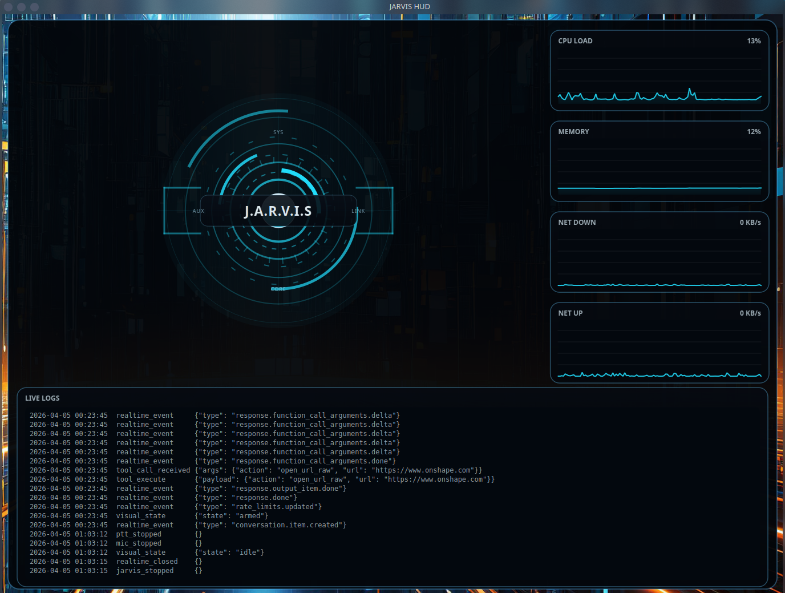
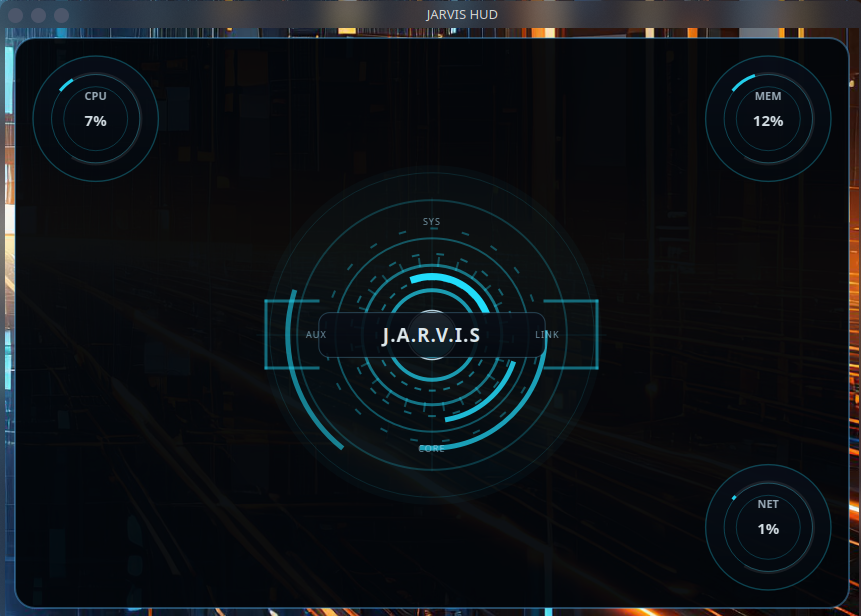

# 🧠 Jarvis v5.1

A local, voice-driven desktop assistant built for real-world control on Linux.

Jarvis is designed to execute actual tasks on your machine — not just respond conversationally.  
It integrates voice, system control, screen awareness, and gesture-based input into a single assistant.

---

## 🖥️ Interface Preview

### Full HUD


### Compact HUD


---

## ⚙️ Current Capabilities (v5.1)

### 🎤 Voice Assistant Core
- Push-to-talk interaction (space bar)
- Speech-to-text via OpenAI Realtime API
- Natural language understanding
- Spoken responses
- Low-friction command execution

### ⚡ Deterministic Tool Execution
Jarvis can reliably trigger local actions such as:
- Opening applications (VS Code, Chrome, Spotify, etc.)
- Opening URLs
- Running predefined system actions
- Executing Home Assistant scripts

All critical actions are routed deterministically to avoid hallucinated behavior.

### 👁️ Screen Awareness
- Captures screenshots of the current desktop
- Uses vision-based reasoning to understand what’s on screen
- Enables context-aware commands

> ⚠️ Currently introduces some latency and is being optimized.

### 📷 Camera Perception
- Uses `/dev/video0` for camera input
- Supports real-time hand tracking via MediaPipe
- Camera feed is hidden from the user during operation

### ✋ Gesture Control System
Fully functional gesture-based mouse control with:
- Hand tracking using MediaPipe
- Cursor movement mapped to hand position
- Pinch gesture for click
- Drag support
- Scroll gestures
- Screenshot gesture
- On-screen hand overlay instead of camera preview
- Bottom-left status indicator

This runs as a separate subsystem and integrates cleanly with the desktop.

### 🖥️ Desktop HUD
- Visual Jarvis HUD with logs output and system metric readouts
- CPU load, memory usage, network download, and network upload display
- Visual state updates:
  - idle = blue
  - processing = purple
  - speaking = orange
- Works with tiling/window managers (tested on Krohnkite)
- Automatically switches to compact mode below ~1/4 screen size

### 🧩 Gesture Overlay UI
- Holographic-style hand overlay
- No visible camera feed
- Minimal, non-intrusive feedback layer

### 🏠 Home Assistant Integration
- Executes scripts via API
- Controls real-world devices
- Deterministic execution (no guessing)

---

## 💻 System Environment

- **OS:** Ubuntu (KDE Plasma)
- **Python:** 3.12
- **Runtime:** Local desktop environment
- **Assistant Style:** Voice-first, low-friction execution

---

## 📁 Project Structure

```text
Jarvis.v5.1/
├── main.py
├── tools.py
├── behavior_learning.py
├── gesture_control/
│   ├── camera_input.py
│   ├── hand_tracker.py
│   ├── gesture_engine.py
│   ├── mouse_router.py
│   ├── overlay_hud.py
│   └── gesture_service.py
├── models/
│   └── hand_landmarker.task
├── screenshots/
├── logs/
```

---

## ⚙️ Setup

### 1. Clone the repository
```bash
git clone https://github.com/xXOceanManiac/Jarvis.git
cd Jarvis.v5.1
```

### 2. Create a virtual environment
```bash
python3 -m venv .venv
source .venv/bin/activate
```

### 3. Install dependencies
```bash
pip install requirements.txt
```

### 4. Home Assistant Integration

Jarvis uses normalized script naming:

jarvis_<domain>_<intent>_<detail>

Examples:
- jarvis_lights_scene_movie
- jarvis_xbox_app_netflix
- jarvis_routine_good_night

Notes:
- Natural language is mapped to scripts via internal phrase matching
- You can extend mappings inside tools.py (HARDCODED_HA_SCRIPTS)
- Script names MUST match Home Assistant exactly

### 5. Configure environment variables

Create a `.env` file in the root directory:

```env
OPENAI_API_KEY=your_key_here
HOME_ASSISTANT_API_KEY=your_token
HOME_ASSISTANT_URL=http://homeassistant.local:8123

```

### 6. Add MediaPipe model for Gesture Control

Place the model here:

```text
models/hand_landmarker.task
```

Or update the path inside:

```text
gesture_control/gesture_service.py
```

---

## 🚀 Running Jarvis

### Start core assistant
```bash
python3 main.py
```

### Start desktop HUD
```bash
python3 jarvis_desktop_hud.py
```

### Start gesture control
```bash
cd gesture_control
python3 gesture_service.py
```

---

## ⚠️ Known Limitations

- Screen context checks introduce noticeable latency  
- No isolated workspace sandbox for code execution (yet)  
- Gesture system requires tuning based on:
  - lighting conditions  
  - camera positioning  

---

## 🧠 Design Philosophy

Jarvis v5.1 is built around:

- Local-first execution  
- Deterministic tool routing  
- Minimal UI friction  
- Real control over the machine  
- No fake actions or hallucinated results  

---

## 📦 What This Version Is

Jarvis v5.1 is a functional foundation featuring:

- Reliable voice control  
- Real desktop interaction  
- Working gesture system  
- Integrated smart home control  

---

## 🚧 What This Version Is NOT (Yet)

- ❌ Full autonomous agent  
- ❌ Planner / executor system  
- ❌ Coding assistant  
- ❌ CAD generation system  

---

## 🧑‍💻 Author

**Tate Lehenbauer**

This project is part of a larger vision:

> Building a fully capable local AI assistant with real control, real awareness, and real execution.