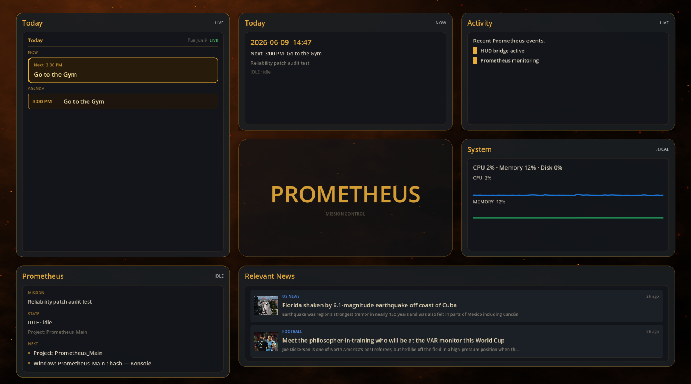

# PROMETHEUS

**PROMETHEUS** is a local-first, voice-driven desktop assistant for Linux. It listens over push-to-talk, routes known commands deterministically to local tools, uses the OpenAI Realtime API for open-ended requests, watches workspace and calendar context, controls Home Assistant devices, runs background coding tasks with Claude, and drives a Godot mission-control dashboard.

## Dashboard Preview



The dashboard (sibling repo directory `../Frontend_Dashboard`, Godot 4) reads `../state/dashboard_state.json`, written continuously by the running core.

## Architecture

One process, one entry point. `main.py` is a thin launcher; everything lives in the `prometheus` package:

```
prometheus/
├── core/          PrometheusCore runtime loop, Realtime API client,
│                  deterministic intent overrides, session context/briefing,
│                  identity/profile, proactive loop
├── voice/         Mic capture, speaker, push-to-talk, wake word
├── execution/     ToolRegistry (desktop_action), coding agent (Claude CLI),
│                  background worker pool, workspace policy, git safety
├── planning/      Planner → Executor → Verifier loop, orchestrator,
│                  workflow selector/registry, decision router
├── agents/        Architect/Coder/Tester/Debugger coding agents,
│                  Lumen calendar ingestion/router/executor agents
├── context/       Contextual intent resolver, world model, mission state
├── memory/        Working/episodic/semantic/procedural memory, vault query
│                  (Obsidian corpus via SQLite FTS5), session summarizer
├── sensors/       Event bus + window/process/clipboard/filesystem/error sensors
├── workspace/     Ambient window/project awareness (wmctrl/xdotool)
├── routines/      Morning routine + calendar event trigger engine
├── integrations/  Google Calendar API adapter, Home Assistant verifier
├── services/      HUD state writer (Godot dashboard), guardian news,
│                  read-only LAN dashboard, visual state
├── policies/      Proactive speech presence gate
└── infra/         Config, paths, logging utils, LLM router (Ollama-first)
```

See [prometheus/ARCHITECTURE.md](prometheus/ARCHITECTURE.md) for request flow, event flow, and how to add a capability.

`gesture_control/` is a standalone camera-gesture subsystem (MediaPipe); it is not part of the core runtime.

## Prerequisites

- Ubuntu / KDE Plasma on X11 (`wmctrl`, `xdotool` for workspace awareness)
- Python 3.12 + virtualenv at `.venv`
- Microphone and speakers (voice), Ollama running locally (fast LLM routing, optional)
- OpenAI API key (Realtime voice), Home Assistant on LAN (device control, optional)
- `claude` CLI on PATH (background coding tasks, optional)
- Godot 4 (dashboard, optional)

## Configuration

Secrets go in `.env` at the repo root (never committed):

```bash
OPENAI_API_KEY=...
HOME_ASSISTANT_API_KEY=...
HOME_ASSISTANT_URL=http://homeassistant.local:8123
PORCUPINE_ACCESS_KEY=...              # optional wake word
PROMETHEUS_MORNING_ROUTINE_ENABLED=true
PROMETHEUS_READONLY_DASHBOARD_ENABLED=false
PROMETHEUS_REALTIME_REQUIRED=false    # true = fail startup if Realtime is down
```

Runtime config lives at `~/.jarvis/config.json` and deep-merges over `DEFAULT_CONFIG` in `prometheus/infra/config.py` (`vault_path` enables the Obsidian memory corpus). Google Calendar OAuth credentials live under `runtime/secrets/google/` (git-ignored).

## Running

```bash
./prometheus.sh start      # systemd user service (autostarts on login)
./prometheus.sh stop | restart | status | logs

# manual / dev
source .venv/bin/activate
python3 main.py

# dashboard (separate window, optional)
../Frontend_Dashboard/launch_dashboard.sh
```

Voice startup failures are non-fatal by default: the core keeps running (HUD writer, routines, calendar triggers) without voice and reports why.

## Testing

```bash
.venv/bin/python -m pytest tests/            # full suite, hermetic (no API calls)
./scripts/prometheus_daily_readiness.sh      # 11 readiness gates, scored
```

Manual diagnostics live in `scripts/` (PTT trace, morning-routine dry runs, HA script tests — the `test_morning_*.py` scripts hit real devices; run deliberately).

The morning routine can be exercised without waiting for a calendar event:

```bash
.venv/bin/python scripts/run_morning_routine_now.py        # real HA calls
```

## Lumen (calendar subsystem)

`../Lumen` is a subordinate calendar-intelligence project with its own tests. Prometheus reads calendars through `prometheus/integrations/google_calendar.py` and exchanges calendar *write* proposals with Lumen through file-based queues (`../Lumen/runtime/outbox` → `runtime/pending|reviewed|approved|completed/lumen_calendar`). Writes require explicit approval:

```bash
python -m prometheus.calendar.lumen_router --list-pending
python -m prometheus.calendar.lumen_executor --approve REQUEST_ID
python -m prometheus.calendar.lumen_executor --execute-approved REQUEST_ID
```

## Known limitations

- Voice requires working audio devices and an OpenAI key; wake word requires Porcupine.
- Workspace awareness is X11-only.
- Home Assistant scripts must exist as `script.jarvis_*` / `script.prometheus_*` entities.
- Legacy `jarvis` naming persists in `~/.jarvis/` state paths and HA entity names.
- The read-only LAN dashboard is HTTP with no auth — LAN-trust only, disabled by default.
