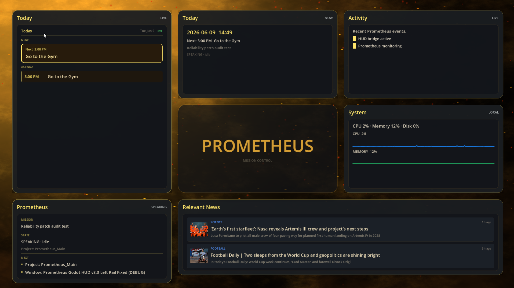
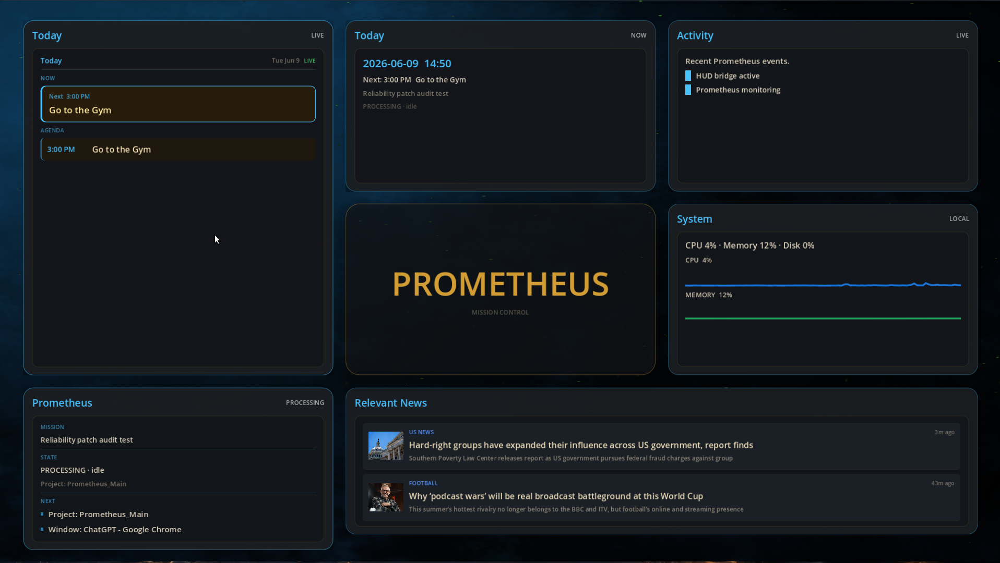
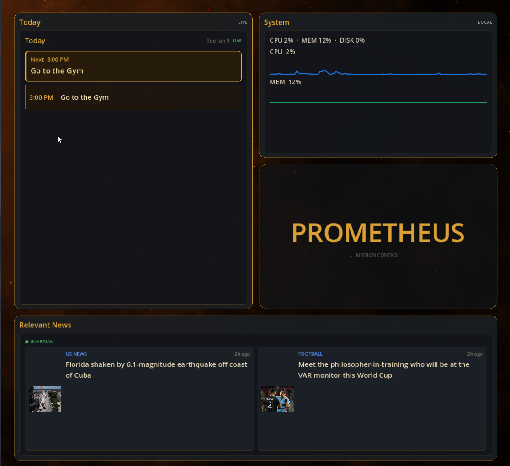

# PROMETHEUS

**PROMETHEUS** is a local-first mission-control assistant built to become more than a voice bot or command launcher.

The goal is a desktop AI system that understands current context, monitors world state, reasons about intent, and safely performs useful tool actions before they become manual work.

PROMETHEUS is currently in the transition stage between a reactive assistant and a context-aware productivity agent. It already has voice infrastructure, realtime diagnostics, calendar awareness, dashboard state visualization, system metrics, activity tracking, Home Assistant groundwork, planner infrastructure, and a Godot-based mission-control frontend.

---

## Dashboard Preview

PROMETHEUS uses a Godot dashboard as the visual operating layer for the assistant. The dashboard reflects assistant state, calendar context, system metrics, recent activity, and relevant news.

### Idle


### Speaking



### Processing



### Compact Layout



---

## What PROMETHEUS Is

PROMETHEUS is being built as a personal operating layer.

It is designed to eventually connect:

* Voice interaction
* Local system state
* Calendar context
* User activity
* Project context
* Home Assistant devices
* Desktop dashboard visualization
* Tool execution
* Memory/logging
* Passive routines
* Safety and approval policy

The long-term goal is not simply:

```text
User asks → assistant answers
```

The goal is:

```text
World changes → PROMETHEUS notices → evaluates importance → prepares action → asks or executes depending on risk
```

PROMETHEUS should eventually be able to notice useful context, surface what matters, prepare actions, and safely automate low-risk routines.

---

## Current Capabilities

PROMETHEUS currently supports or partially supports:

### Voice and Realtime Interaction

* Push-to-talk interaction flow
* Local audio capture
* Realtime assistant loop
* OpenAI Realtime API integration
* Standalone speech-to-text diagnostic path
* Reconnect and reliability handling
* Trace logging for voice sessions
* Runtime state transitions such as idle, processing, speaking, and executing

### Diagnostics and Logging

* Local JSONL runtime logs
* Push-to-talk diagnostic script
* Event traces for audio capture, speech recognition, assistant state, and tool flow
* Debug tooling for inspecting recent PROMETHEUS activity
* Reliability/audit test infrastructure

### Dashboard

* Godot-based mission-control interface
* State-aware visual theme changes
* Idle, speaking, and processing visual modes
* Calendar card
* PROMETHEUS state card
* System metrics card
* Activity card
* Relevant news card
* Compact layout support
* Live-feeling animated background
* Visual identity centered around PROMETHEUS as mission control

### Calendar Context

PROMETHEUS uses **Lumen** as a subordinate calendar intelligence subsystem.

Current or planned Lumen capabilities include:

* Reading upcoming calendar events
* Summarizing today’s schedule
* Finding the next event
* Finding free blocks
* Preparing calendar-aware recommendations
* Feeding calendar context back into PROMETHEUS

Lumen is not intended to be a separate assistant. It is a subsystem under PROMETHEUS.

### System Awareness

The dashboard can surface local system metrics such as:

* CPU usage
* Memory usage
* Disk usage
* Recent metric history
* Runtime/system state

### Home Assistant Groundwork

PROMETHEUS includes groundwork for a Home Assistant bridge so it can eventually coordinate:

* Lights
* Scenes
* Wake routines
* Sleep routines
* Device state
* Room/environment automations
* Calendar-triggered actions

### Planner and Intent Infrastructure

PROMETHEUS includes early infrastructure for:

* Intent classification
* Context resolution
* Planning
* Tool routing
* Risk-aware execution decisions
* Workspace safety checks
* Audit/regression testing

---

## Current Development Status

PROMETHEUS is actively under development.

### Working or partially working

* Realtime voice loop
* Push-to-talk diagnostics
* Local assistant state tracking
* Godot dashboard
* Calendar context through Lumen
* Runtime logs and event traces
* System metrics display
* Activity display
* Relevant news panel groundwork
* Planner and intent infrastructure
* Workspace safety policy
* Home Assistant integration groundwork

### Still in progress

* Reliable passive execution
* Full dashboard interactivity
* Dynamic dashboard card rearrangement
* Stronger memory and project-state awareness
* Production-grade Home Assistant routines
* Tool approval workflow
* Long-term context persistence
* Robust install/setup flow
* Complete user-facing documentation

---

## Project Structure

Current high-level structure:

```text
PROMETHEUS/
├── Prometheus_Main/
│   ├── realtime_client.py
│   ├── prometheus/
│   ├── tools/
│   ├── scripts/
│   ├── assets/
│   │   ├── idle.png
│   │   ├── speaking.png
│   │   ├── processing.png
│   │   └── compact.png
│   └── ...
│
├── Frontend_Dashboard/
│   └── Godot mission-control dashboard
│
├── Lumen/
│   └── Calendar intelligence subsystem
│
├── FireCore/
│   └── Visual and animation experiments
│
└── legacy_dashboard/
    └── Archived earlier dashboard experiments
```

`Prometheus_Main` is the mission-control core.

`Frontend_Dashboard` is the visual interface.

`Lumen` is the calendar/schedule intelligence subsystem.

`FireCore` contains visual experiments.

`legacy_dashboard` contains older dashboard implementations kept for reference.

---

## Architecture Overview

PROMETHEUS is designed around a layered agent architecture.

```text
┌─────────────────────────────────────────────────────────────┐
│                         WORLD STATE                         │
│ Calendar • Time • System Metrics • Logs • News • HA Devices │
│ User Activity • Open Windows • Project State • Environment  │
└──────────────────────────────┬──────────────────────────────┘
                               │
                               ▼
┌─────────────────────────────────────────────────────────────┐
│                      CONTEXT BUILDER                        │
│ Collects the current situation into a usable snapshot.       │
│ Keeps PROMETHEUS grounded in what is happening now.          │
└──────────────────────────────┬──────────────────────────────┘
                               │
                               ▼
┌─────────────────────────────────────────────────────────────┐
│                    INTENT RESOLUTION                        │
│ Determines what the user likely wants, what risk is present, │
│ and whether the request is safe, actionable, or ambiguous.   │
└──────────────────────────────┬──────────────────────────────┘
                               │
                               ▼
┌─────────────────────────────────────────────────────────────┐
│                         PLANNER                             │
│ Converts intent and context into a plan.                     │
│ Chooses whether to answer, ask, execute, defer, or monitor.  │
└──────────────────────────────┬──────────────────────────────┘
                               │
                               ▼
┌─────────────────────────────────────────────────────────────┐
│                     POLICY / SAFETY                         │
│ Checks tool permissions, workspace boundaries, approval      │
│ requirements, and risk level before action.                  │
└──────────────────────────────┬──────────────────────────────┘
                               │
                               ▼
┌─────────────────────────────────────────────────────────────┐
│                       EXECUTION                             │
│ Runs approved tools, scripts, calendar actions, HA actions,  │
│ file operations, diagnostics, or dashboard updates.          │
└──────────────────────────────┬──────────────────────────────┘
                               │
                               ▼
┌─────────────────────────────────────────────────────────────┐
│                      MEMORY / LOGGING                       │
│ Stores traces, outcomes, failures, useful context, and       │
│ signals for future reasoning and debugging.                  │
└─────────────────────────────────────────────────────────────┘
```

---

## How PROMETHEUS Thinks

PROMETHEUS is being designed to reason in stages.

### 1. Observe

PROMETHEUS collects signals from the current environment.

Examples:

* What time is it?
* What is on the calendar?
* What is the user working on?
* What state is the assistant in?
* Are there recent errors?
* What system resources are active?
* Are there Home Assistant devices that matter?
* Are there upcoming events?
* Has the user been idle, focused, or active?

### 2. Interpret

PROMETHEUS turns raw signals into context.

Examples:

```text
The user has a gym event soon.
The user is currently working in the PROMETHEUS repo.
The assistant is idle.
The dashboard should show calendar and system state.
A recent diagnostic event happened.
```

### 3. Decide

PROMETHEUS determines whether anything should happen.

Examples:

```text
No action needed.
Surface a reminder.
Prepare a suggested action.
Ask for approval.
Execute a safe pre-approved routine.
Log the issue for later.
```

### 4. Act

PROMETHEUS executes only after policy allows it.

Possible actions include:

* Responding to the user
* Updating the dashboard
* Running a diagnostic
* Checking calendar context
* Triggering a Home Assistant routine
* Opening or preparing a workflow
* Logging a state change
* Asking for approval before a risky action

### 5. Remember

PROMETHEUS stores useful traces and outcomes so future decisions can improve.

---

## Passive Execution Vision

The major direction for PROMETHEUS is passive, context-aware productivity support.

PROMETHEUS should eventually support routines like:

### Calendar-driven actions

```text
If an event requires driving:
→ check time until departure
→ prepare departure context
→ optionally turn off lights/devices
→ surface navigation/reminder context
```

### Wake/sleep intelligence

```text
If the user stays up late and the morning is open:
→ suggest a later wake time
→ adjust wake routine only with approval
```

### Focus protection

```text
If the user is in a focused work block:
→ reduce unnecessary notifications
→ surface only high-priority context
```

### Local environment automation

```text
If the user starts a work session:
→ prepare lighting
→ show relevant project dashboard
→ suppress unrelated cards
```

### Failure detection

```text
If logs show repeated failure:
→ surface issue in dashboard
→ prepare diagnostic summary
→ suggest a fix
```

### Routine execution

```text
If a low-risk action is already approved:
→ execute quietly
→ log what happened
→ notify only if useful
```

---

## Safety Model

PROMETHEUS should never blindly execute actions just because it can.

The intended safety model is:

```text
Low risk + approved pattern
→ execute automatically

Medium risk or uncertain context
→ prepare recommendation and ask

High risk, destructive, financial, private, or external-impact action
→ require explicit approval

Unknown or ambiguous action
→ ask for clarification
```

Examples:

| Action Type                        | Expected Behavior                                 |
| ---------------------------------- | ------------------------------------------------- |
| Update dashboard state             | Execute automatically                             |
| Read calendar context              | Execute automatically                             |
| Turn on a pre-approved light scene | Execute automatically or ask depending on context |
| Send a message/email               | Ask first                                         |
| Delete files                       | Ask first                                         |
| Modify external services           | Ask first                                         |
| Financial or purchase action       | Ask first                                         |
| Unknown tool action                | Ask first                                         |

The more passive PROMETHEUS becomes, the more important the safety model becomes.

---

## Dashboard Philosophy

The dashboard is not meant to be decoration.

It is intended to become the visual operating layer of PROMETHEUS.

Design goals:

* The dashboard should be useful every day.
* PROMETHEUS should feel alive without becoming distracting.
* Cards should show real context, not filler.
* State changes should be visible.
* The background should feel like PROMETHEUS living behind the interface.
* Information should rearrange around what matters now.
* The user should be able to glance at the dashboard and know what PROMETHEUS sees.
* Idle mode should still be useful.
* Processing/speaking/executing modes should be visually distinct.
* Calendar, activity, metrics, and current objective should remain easy to read.

---

## Main Subsystems

### Prometheus Main

The core assistant runtime.

Responsibilities:

* Realtime assistant loop
* Push-to-talk flow
* Tool coordination
* Planner integration
* Runtime state
* Diagnostics
* Logging
* Safety policy
* Workspace restrictions
* Local project context

### Lumen

The calendar intelligence subsystem.

Responsibilities:

* Read calendar events
* Summarize upcoming schedule
* Find next event
* Find free blocks
* Prepare calendar-aware recommendations
* Provide schedule context to PROMETHEUS

Lumen exists under PROMETHEUS architecturally. It is not a competing assistant.

### Frontend Dashboard

The Godot dashboard.

Responsibilities:

* Visualize assistant state
* Show calendar context
* Show system metrics
* Show recent activity
* Show relevant news
* Reflect idle/processing/speaking/executing modes
* Eventually support dynamic card layouts

### Home Assistant Bridge

The environment-control layer.

Responsibilities:

* Lights
* Scenes
* Device routines
* Wake/sleep automation
* Calendar-triggered routines
* Local environment state

### Tools and Scripts

PROMETHEUS includes helper scripts for:

* Diagnostics
* Logs
* Runtime inspection
* Audio/PTT tracing
* Integration testing
* Audit checks

---

## Example Use Cases

Current and intended use cases include:

### Voice assistant

```text
User holds push-to-talk → PROMETHEUS listens → responds or acts
```

### Calendar awareness

```text
PROMETHEUS sees upcoming events and displays the next relevant item.
```

### Daily dashboard

```text
The dashboard shows today’s schedule, system metrics, activity, news, and current PROMETHEUS state.
```

### Debugging assistant

```text
PROMETHEUS logs traces and diagnostics so failures can be inspected quickly.
```

### Home automation coordinator

```text
PROMETHEUS eventually coordinates lights, scenes, wake routines, and device state.
```

### Passive productivity agent

```text
PROMETHEUS notices world-state changes and prepares helpful actions without waiting for manual commands.
```

---

## Installation

This project is currently optimized for local development on Linux.

The current development environment is:

* Ubuntu Linux
* KDE Plasma / X11
* Python virtual environment
* Godot 4.x for the dashboard
* Home Assistant on the local network
* Google Calendar integration through Lumen
* OpenAI Realtime API

Clone the repo:

```bash
git clone git@github.com:tatelehenbauer/prometheus.git
cd prometheus
```

Create and activate a Python environment inside `Prometheus_Main`:

```bash
cd Prometheus_Main
python3 -m venv .venv
source .venv/bin/activate
```

Install Python dependencies:

```bash
pip install -r requirements.txt
```

If this repo does not yet have a complete `requirements.txt`, dependencies may still need to be installed manually from the active development environment.

---

## Environment Variables

PROMETHEUS requires local secrets for external services.

Typical environment values may include:

```bash
OPENAI_API_KEY=...
GOOGLE_CLIENT_ID=...
GOOGLE_CLIENT_SECRET=...
GOOGLE_REFRESH_TOKEN=...
HOME_ASSISTANT_URL=...
HOME_ASSISTANT_TOKEN=...
```

Do not commit real secrets.

Recommended local files:

```text
.env
.env.local
*.token.json
credentials.json
```

These should be ignored by Git.

---

## Running PROMETHEUS

From the main runtime directory:

```bash
cd Prometheus_Main
source .venv/bin/activate
python3 realtime_client.py
```

Diagnostic scripts live under:

```text
Prometheus_Main/scripts/
```

Tools live under:

```text
Prometheus_Main/tools/
```

A typical diagnostic flow may look like:

```bash
./scripts/prometheus_ptt_diagnostic.sh
python3 tools/prometheus_trace_debug.py --last
```

---

## Running the Dashboard

The dashboard lives in:

```text
Frontend_Dashboard/
```

Open the project in Godot and run the main dashboard scene.

The dashboard currently expects state/data files from PROMETHEUS runtime and local integrations. Some cards may show placeholders if those feeds are unavailable.

---

## Repository Rename Notes

This project previously used the name `jarvis` in some places.

The GitHub repository can be safely renamed to `prometheus`, but internal references should be renamed carefully.

Safe first step:

```bash
git remote set-url origin git@github.com:tatelehenbauer/prometheus.git
```

Then verify:

```bash
git remote -v
```

Do not blindly replace every `jarvis` string yet.

Legacy references may exist in:

* Script names
* Log paths
* Service names
* Imports
* Home Assistant entities
* Dashboard paths
* Environment variables
* Historical comments
* Archived files

A controlled internal rename should happen separately after confirming what each reference does.

---

## Development Principles

PROMETHEUS should be developed with the following principles:

### Do not regress working systems

Avoid large rewrites unless absolutely necessary.

### Preserve working diagnostics

Diagnostics are part of the product. If something breaks, PROMETHEUS should help explain why.

### Prefer real data over fake UI

Dashboard cards should use real metrics, logs, calendar data, and state whenever possible.

### Keep subsystems separated

Prometheus Main, Lumen, the Godot dashboard, and Home Assistant integrations should remain conceptually separate.

### Make passive execution safe

The more PROMETHEUS acts without direct commands, the stronger the approval and safety model must be.

### Build toward daily usefulness

PROMETHEUS should become useful even before full autonomy is complete.

---

## Roadmap

### Near Term

* Stabilize voice/realtime loop
* Improve push-to-talk reliability
* Harden diagnostics
* Improve dashboard layout and readability
* Add stronger dashboard interactivity
* Improve calendar card and timeline display
* Improve activity/event feed
* Continue Home Assistant bridge work

### Medium Term

* Add passive routine scheduler
* Add approval queue for suggested actions
* Add stronger planner/tool execution policy
* Improve local project awareness
* Add better memory/context persistence
* Let dashboard cards rearrange based on current context
* Add richer calendar-driven automations
* Add wake/sleep routines

### Long Term

* Context-aware passive productivity agent
* Safe automatic execution of approved low-risk routines
* Full Home Assistant coordination
* Project-aware work assistance
* Daily briefing and evening review
* Strong visual mission-control dashboard
* Local-first personal operating layer

---

## Current Limitations

PROMETHEUS is not production-ready.

Known limitations:

* Some dashboard cards are still evolving.
* Passive execution is not fully reliable yet.
* Some integrations may depend on local paths.
* Setup is not fully automated.
* Internal legacy naming may still reference `jarvis`.
* Home Assistant routines are still being formalized.
* Calendar intelligence is still expanding.
* Tool approval policy is still under active development.

---

## Why PROMETHEUS Exists

Most assistants wait for explicit commands.

PROMETHEUS is being built around a different idea:

```text
A useful assistant should understand the current situation,
know what matters,
prepare the next useful action,
and only interrupt when it should.
```

PROMETHEUS is the foundation for that personal mission-control layer.

---

## License

Private / personal development project unless otherwise specified.

---

## Status

Active development.
